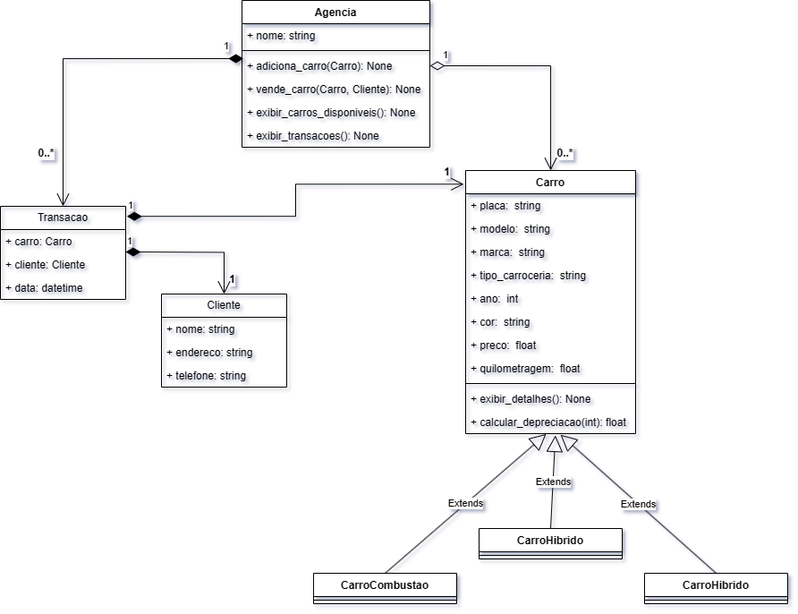

# Agência de carros usados
Desafio proposto pelo professor Paulo Marcotti à turma Boole.py do programa Alpha Edtech. O objetivo é a pratica do paradigma de orientação a objetos através do desenvolvimento de um projeto cujo o tema é de escolha do aluno. Neste caso, o tema escolhido para a elaboração do projeto foi de uma agência de carros usados. Ele simula uma agência de carros usados, onde é possível adicionar carros, listar carros disponíveis e vender carros.

## Diagrama

## Para executar o projeto é preciso...

- Ter o Python instalado
- Clonar este repositório
- Execute `python main.py` para iniciar o programa

## Estrutura do Projeto

- `agencia.py`: Contém a implementação da classe Agencia.
- `carro.py`: Contém a implementação da classe Carro.
- `carro_combustao`: Contém a implementação da classe CarroCombustao.
- `carro_hibrido`: Contém a implementação da classe CarroHibrido.
- `carro_eletrico`: Contém a implementação da classe CarroEletrico.
- `cliente`: Contém a implementação da classe Cliente.
- `transacao`: Contém a implementação da classe Transacao.
- `dados`: Contém uma lista de instâncias de carros.
- `main.py`: Programa principal para interação pelo terminal.
